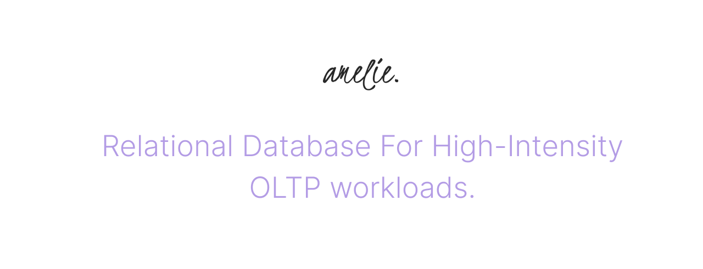

### Full Parallelization of IO and Compute

Amelie is a lightweight, full-featured, in-memory OLTP SQL relational database that
allows full parallelization and lockless transaction processing.

It scales linearly with the number of CPU cores both for IO and Compute separately,
performs automatic partitioning, and generates parallel group plans for
all types of queries.

Learn more about [How It Works](https://amelielabs.io/overview.html) and [Get Started](https://amelielabs.io/docs/).

Official Docker image is coming soon.

### Asynchronous Replication

Amelie has support for Hot Backup and Async Logical Replication, which allows
fault-tolerant primary-replica setups to be created.

### Easy to use

It works over HTTP and does not require additional client libraries. Any modern programming language or
tooling that supports HTTP and JSON can be used directly.
Compiles and distributes as a single binary.

### Development and Features

Amelie was built from scratch, and its research and development took over seven years. Dozens of prototypes explored different
ideas and approaches until the first public release.

The SQL dialect is based on ANSI SQL, PostgreSQL and extended with unique features, such as native JSON support and Lambda aggregates.

The short list of features:

* Serializable ACID Multi-statement transactions 
* Secondary indexes (Tree/Hash)
* CTE with DML RETURNING
* Parallel partitioned DML including UPSERT
* Parallel JOINs
* Parallel GROUP BY and ORDER BY
* Parallel VECTOR operations
* Partitioned Generated Columns
* Native VECTOR support
* Native JSON support
* Parallel snapshotting and recovery
* Hot Remote Backup
* Asynchronous Logical Replication
* HTTP API
